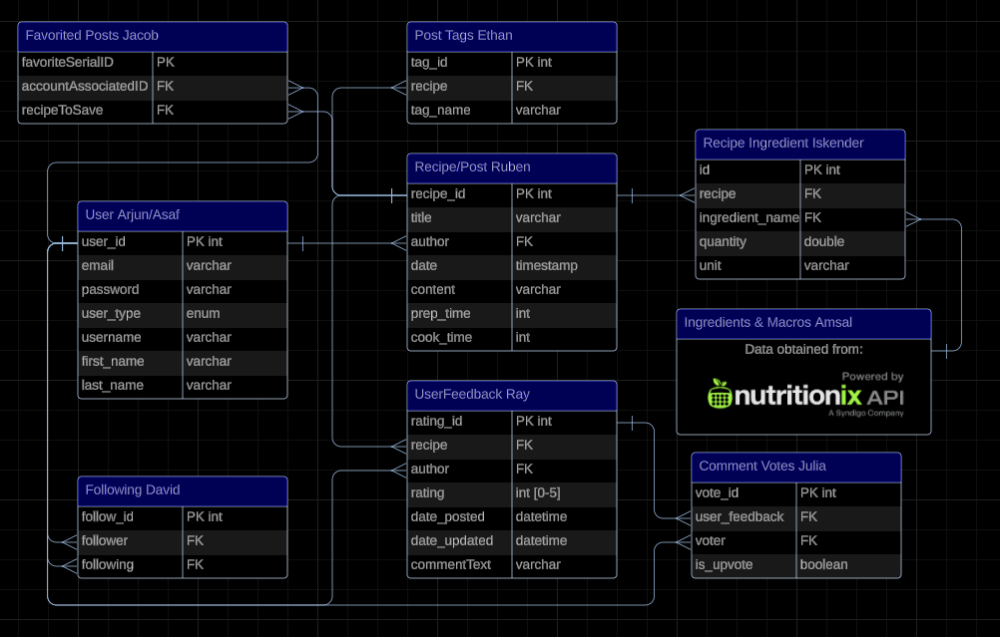

# ByteShare Back End
Team 1 ByteShare

## Background of Project:
ByteShare is a food social media app where Authors are able to create their recipes and share them to the world. Authors, Admins, and Users are able to comment, vote, and rate recipes. They further more are able to follow other authors and favorite a recipe for easier access it in the future.

## Set Up:
1. Navigate to root directory in vsc
2. run ```npm install``` in vsc
3. Make sure `ByteshareApplication.java` is running in separate window or in intellij
4. run ```npm run dev``` in vsc

## Contributors:
- Ray Eichler (Co Scrum Master)
- Julia Pham (Co Scrum Master)
- Arjun Ramsinghani (Back End Lead)
- David Jeske (Front End Lead)
- Ethan Vrooman (GitHub Lead)
- Asaf Ahmed (DevOps Lead)
- Amsal Kassam
- Iskender Mederov
- Jacob Ryan
- Ruben Fitch

## Entity Relationship Diagram
